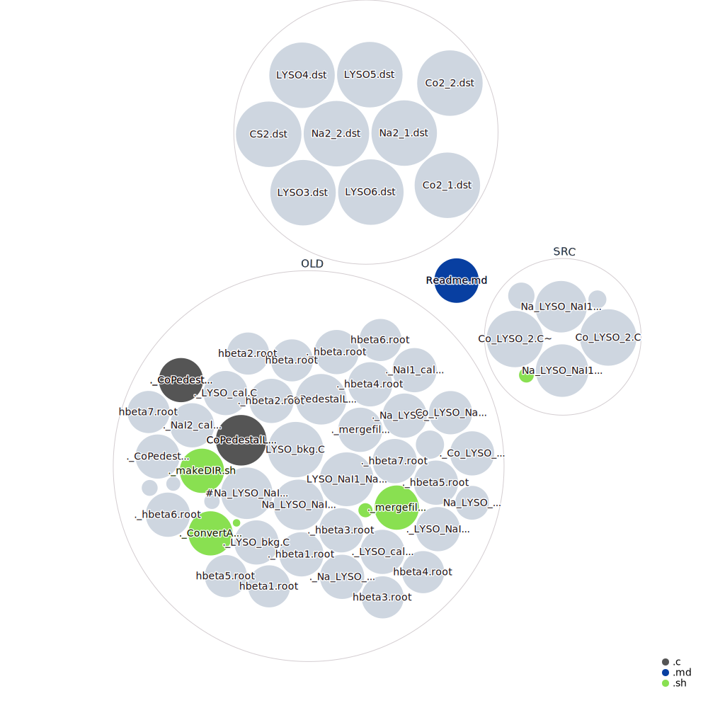

# Lab esperienza 1

## Table of contents
- Logbook
- Data analysis

# **Logbook**
Below it has been reported the log concerned the data acquired during the lab experience.

-----------------------------------

- FILE NAME: LYSO3.dst ID 300
- FILE NAME: LYSO4.dst ID 400

Measurement of 200 keV or 300 keV and beta decay in the LYSO

## Oscilloscope channels

- Channel 1 LYSO no amplification
- Channel 2 LYSO amplified 
- Channel 3 NaI 1
- Channel 4 NaI 2

## Oscilloscope settings

| Channel  |  Y scale  | Trigger   |  Threshold |
|----------|-----------|-----------|------------|
|     1    |   2 mV    | No        |            |
|     2    |   10 mV   | NegEdge   |   -3 mV    |
|     3    |   10 mV   | NegEdge   |   -3 mV    |
|     4    |   10 mV   | NegEdge   |   -3 mV    |

Trigger pattern = AND

--------------------------------------------------------------

- FILE NAME Co2_1.dst ID 400

Calibration of the NaI scintillators with Co 60 source

| Channel  |  Y scale  | Trigger   |  Threshold |        |
|----------|-----------|-----------|------------|--------|
|     1    |   2 mV    | No        |            |        |
|     2    |   2 mV    | NegEdge   |   -2 mV    | (Veto) |
|     3    |   50 mV   | NegEdge   |    -5 mV   |        |
|     4    |   50 mV   | NegEdge   |    -5 mV   |        |

Trigger Pattern (~no.2 ) & (no. 3) & (no. 4)

-------------------------------------------------------

- FILE NAME: Co2_2.dst ID 500

Calibratione of the LYSO crystal with C0 60 source

| Channel  |  Y scale  | Trigger   |  Threshold |        |
|----------|-----------|-----------|------------|--------|
|     1    |   2 mV    | No        |            |        |
|     2    |   10 mV   | NegEdge   |    -15 mV  |        |
|     3    |   10 mV   | No        |    -5 mV   | (Veto) |
|     4    |   50 mV   | NegEdge   |    -33 mV  |        |

Trigger	Pattern	(no.2 ) & (~no. 3) & (no. 4)

-----------------------------------------------

- FILE NAME: Na2_1.dst

Calibration with Na22 source
LYSO should see 1200 keV
The source is between the two NaIs

| Channel  |  Y scale  | Trigger   |  Threshold |
|----------|-----------|-----------|------------|
|     1    |   2 mV    | No        |            |
|     2    |   10 mV   | NegEdge   |    -10 mV  |
|     3    |   20 mV   | NegEdge   |    -7 mV   | 
|     4    |   20 mV   | NegEdge   |    -7 mV   |

Trigger Pattern : (no.2 ) & (no. 3) & (no. 4)

---------------------------------------------------------

- FILE NAME : Na2_2.dst

PMTs calibration
NaI1 (ch.3) should see the 1200 keV peak while NaI2 and LYSO should se the two photons at 511 keV

| Channel  |  Y scale  | Trigger   |  Threshold |
|----------|-----------|-----------|------------|
|     1    |   2 mV    | No        |            |
|     2    |   10 mV   | NegEdge   |    -4 mV   |
|     3    |   50 mV   | NegEdge   |    -10 mV  |
|     4    |   20 mV   | NegEdge   |    -7 mV   |

Trigger Pattern : (no.2 ) & (no. 3) & (no. 4)

--------------------------------------------------------

 - FILE NAME : LYSO5

Background LYSO without sources 

| Channel  |  Y scale  | Trigger   |  Threshold |       |
|----------|-----------|-----------|------------|-------|
|     1    |   2 mV    | No        |            |       |
|     2    |   10 mV   | NegEdge   |    -1 mV   |       |
|     3    |   10 mV   | NegEdge   |    -5 mV   | (Veto)|
|     4    |   10 mV   | NegEdge   |    -5 mV   | (Veto)|

Trigger Pattern : (no.2 ) & (~no. 3) & (~no. 4)

------------------------------------------------

-- FILE NAME : CS2

Measurement of the gamma spectrum of Cs 137. Measurement to do after the calibration.

| Channel  |  Y scale  | Trigger   |  Threshold |       |
|----------|-----------|-----------|------------|-------|
|     1    |   2 mV    | No        |            |       |
|     2    |   10 mV   | NegEdge   |    -1 mV   |       |
|     3    |   10 mV   | NegEdge   |    -5 mV   | (Veto)|
|     4    |   10 mV   | NegEdge   |    -5 mV   | (Veto)|

Trigger Pattern : (no.2 ) & (~no. 3) & (~no. 4)

---------------------------------------------------------------

- FILE NAME : LYSO6

Background measurement

| Channel  |  Y scale  | Trigger   |  Threshold |
|----------|-----------|-----------|------------|
|     1    |   2 mV    | No        |            |
|     2    |   10 mV   | NegEdge   |    -1 mV   |
|     3    |   10 mV   | NegEdge   |    -5 mV   |
|     4    |   10 mV   | NegEdge   |    -5 mV   |

Trigger Pattern : (no.2 ) & (~no. 3) & (~no. 4)

---------------------------------------------------

# **Data analysis**

First, I am going to display the histogram acquired from the LYSO crystal without any sources.
- The file name used is LYSO3.dst and LYSO4.dst.
- The script used is LYSO_NaI1_NaI2.c

## LYSO Background measurement
The first mesure consists of the measurement of the background due to the intrinsic radioactivity of the LYSO crystal. In order to perform this measurement we have used the following configuration:
- LYSO crystal in the middle of the experimental setup
- 2 NaI crystal scintillators 
- Triggering pattern used is given by: NaI1 & NaI2 & LYSO(amplificated) (NOTE: & is a logical AND port)

After filtering data using some masks it is possible to see the **Pulse height spectrum** (or better, the area spectrum) of the LYSO crystal

## Calibration of the NaI scintillators and LYSO

### NaI calibration with Co and pedestal LYSO

Exploiting the configuration in which the LYSO, which is removed from the table on which are positioned the two NaI, is vetoed, it is possible to calibrate the two NaI. 
Below the spectra measured with the Co source

Since the LYSO is vetoed it is possible to exploit this configuration to measure the pedestal. The area, in fact, is not exactly calibrated since the signal is affected by a small baseline.

This histogram is obtained by using the area measured by the channel 2 which is exactly the LYSO crystal, shilded by a Pb coating.

### LYSO Calibration with Co

In order to calibrate LYSO we need to put NaI1 in anticoincidence with the LYSO and the NaI2. The file used for this section is **Co2_2.dst**. See the loogbook. Below, the histogram shows that it is quite difficult to distinguish the two Co peaks using only the LYSO because its resolution is lower respect to the resolution of the NaI. 

Using the coincidence detection with one of the two NaI we can select some particularly useful events.
Here, the zoom on the area of interest. Using some mask applied on the data we can select the useful events for the calibration.

After a careful selection of the data we are able to distinguish the two Co peaks in the LYSO

From the fit we can measure the value of the center of the gaussian shapes and the resolutions of the peaks

At this point, we measure the spectrum of a Na 22 source, by exploiting two configurations, depending on the position of the source with respect to the detectors.
In the first configuration, the source is between the two NaI scintillators. In this way, we expect that the NaIs will detect the two photons at 511 keV, while the LYSO will detect the photon at 1275 keV. The file in which this measurement is recorded is **Na_2_1.dst**.

In this plot, the areas of the two NaIs is shown. It is very clear the common peak at 511 keV, and also the orizontal and vertical compton edges.

(The spectrum of the other NaI is very similar to the one reported)

In the spectrum collected by the LYSO, it is possible to see both the peaks at 1275 keV and at 511 keV, which is a combination both of the photon from the Na source and the summation of the photons from the LYSO.

In the second configuration, the source is between the LYSO and NaI2, which will detect the photons at 511 keV, while NaI1 measures the photon at 1275 keV. The file in which this measurement is recorded is **Na_2_2.dst**.

